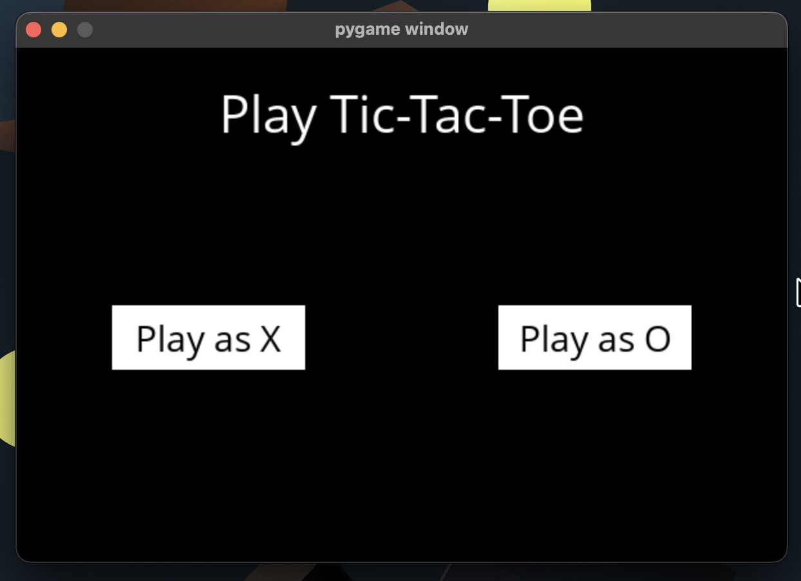
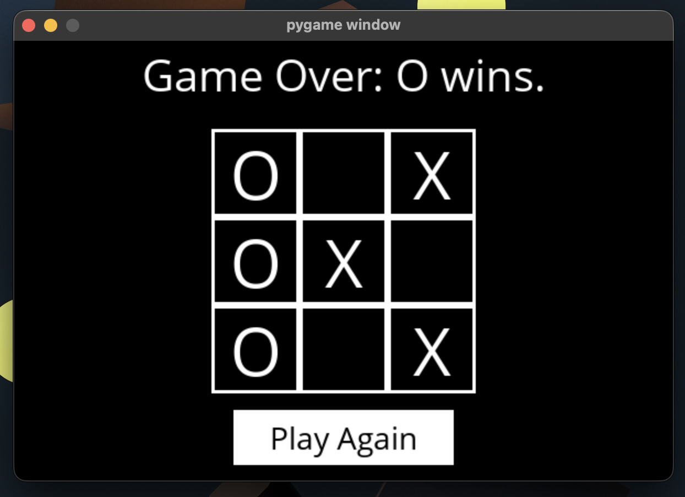

# AI Tic-Tac-Toe using Minimax

An intelligent Tic-Tac-Toe game built with Python and Pygame. The AI uses the Minimax algorithm to calculate the best possible move and plays optimally against the user.

## Features

- Human vs AI gameplay
- Intelligent move selection using Minimax
- Detects wins, losses, and draws
- Interactive Pygame interface
- Restart option after the game ends
- AI plays optimally and cannot be defeated when implemented correctly

## AI Concepts Used

- Minimax Algorithm
- Adversarial Search
- Game Trees
- Recursive Decision Making
- Utility Functions

## Technologies

- Python
- Pygame

## Project Structure

```text
.
├── screenshots/
│   ├── home-screen.png
│   └── game-over.png
├── tictactoe.py
├── runner.py
├── requirements.txt
├── OpenSans-Regular.ttf
├── README.md
├── LICENSE
└── .gitignore
```

## Screenshots

### Home Screen



### Game Over



## Installation

```bash
git clone https://github.com/ambertiwary27/ai-tic-tac-toe-minimax.git
cd ai-tic-tac-toe-minimax
python3 -m pip install -r requirements.txt
```

## Run the Project

```bash
python3 runner.py
```

## How It Works

The AI uses the **Minimax Algorithm** to evaluate all possible game states and always chooses the optimal move.

### Key Concepts

- Minimax Search
- Recursive Decision Making
- Utility Function
- Adversarial Search
- Optimal Move Selection

## Learning Outcomes

This project demonstrates:

- Artificial Intelligence fundamentals
- Game Tree Search
- Decision Making Algorithms
- Python Programming
- Pygame GUI Development

## Acknowledgements

This project was developed as part of **Harvard CS50's Introduction to Artificial Intelligence with Python**. The implementation builds upon the course assignment while demonstrating the Minimax algorithm for optimal game-playing AI.

## Author

**Amber Kumar Tiwary**

- GitHub: https://github.com/ambertiwary27